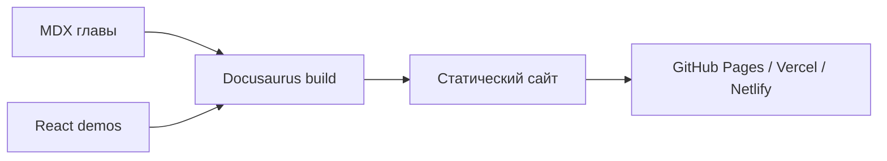

# Технологический стек

Проект устроен как статический сайт: исходники живут в репозитории, сборка
генерирует готовые HTML, CSS и JavaScript файлы, которые можно отдать через
GitHub Pages или любой другой static hosting.

## Базовый выбор

- **Docusaurus** - каркас сайта, документация, sidebar, i18n и сборка.
- **MDX** - формат глав с поддержкой React-компонентов внутри текста.
- **TypeScript** - типизация конфигурации и интерактивных компонентов.
- **KaTeX** - формулы в Markdown/MDX.
- **Mermaid** - диаграммы без ручной верстки изображений.
- **pnpm** - быстрый и воспроизводимый package manager.

Поиск пока не включен. Для учебника он понадобится, но его лучше добавить
отдельно после выбора между Algolia DocSearch, Pagefind и локальным индексом.

## Почему не ручной HTML

Ручные HTML-страницы быстро дадут полный контроль, но цена поддержки будет
расти с каждой новой главой. Для учебника важнее единые оглавления, навигация,
поиск, локализация и возможность переиспользовать компоненты.

Стек остается статическим на выходе, но дает место для интерактивных объяснений.

## Проверка математики

MDX-страницы уже поддерживают inline-формулы вроде $R_{ui}$ и блочные формулы:

$$
\hat r_{ui} = p_u^\top q_i
$$

Этого достаточно для большинства классических моделей, метрик ранжирования и
разборов оптимизационных задач.
